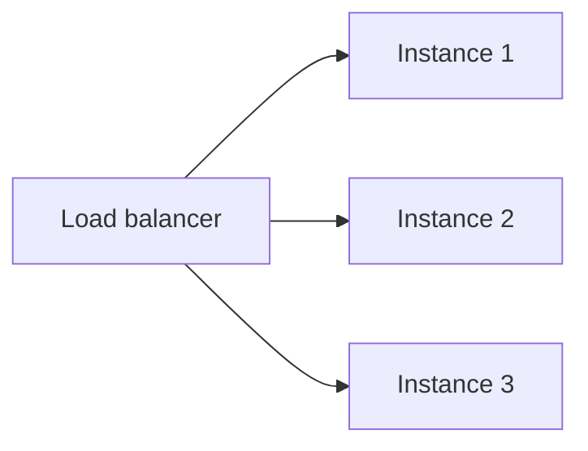

# Autoscaling and Load Balancing

## Why it matters
Autoscaling and load balancing keep services responsive under changing load.

## Progression checkpoints
| Level | Focus |
| --- | --- |
| Beginner | Understand autoscaling groups. |
| Intermediate | Configure scaling policies. |
| Senior | Use predictive and scheduled scaling. |
| Principal | Define scaling standards and budgets. |

## Key concepts
- Horizontal vs vertical scaling.
- Load balancers and health checks.
- Scaling triggers and cooldowns.

## Real-world example: Traffic spike
An autoscaling group adds instances when CPU exceeds 70%.

## Diagram

## Practical checklist
- Use health checks for scaling decisions.
- Set cooldowns to prevent thrashing.
- Monitor scaling events and costs.
