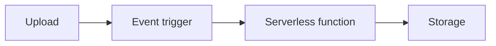

# Serverless and Event Triggers

## Why it matters
Serverless simplifies operations and scales automatically for event-driven
workloads.

## Progression checkpoints
| Level | Focus |
| --- | --- |
| Beginner | Use basic serverless functions. |
| Intermediate | Handle cold starts and limits. |
| Senior | Design event-driven pipelines. |
| Principal | Define serverless usage standards. |

## Key concepts
- Event triggers (HTTP, queue, storage).
- Cold starts and concurrency limits.
- Stateless execution and timeouts.

## Real-world example: Image resizing
An upload triggers a function that generates thumbnails and stores them.

## Diagram

## Practical checklist
- Keep functions small and fast.
- Set timeouts and memory limits.
- Monitor cold start rates.
