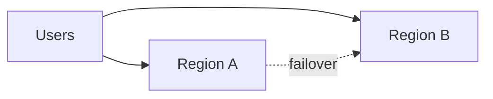

# Multi-Region and DR

## Why it matters
Multi-region deployments increase availability and reduce latency.

## Progression checkpoints
| Level | Focus |
| --- | --- |
| Beginner | Understand region concepts. |
| Intermediate | Use failover and active-passive. |
| Senior | Design active-active architectures. |
| Principal | Define DR and compliance policies. |

## Key concepts
- Region failover and routing.
- Active-active vs active-passive.
- Data replication and consistency.

## Real-world example: Global API
Traffic routes to the closest region, with failover on health checks.

## Diagram

## Practical checklist
- Test failover regularly.
- Document RPO and RTO targets.
- Keep configurations consistent across regions.
