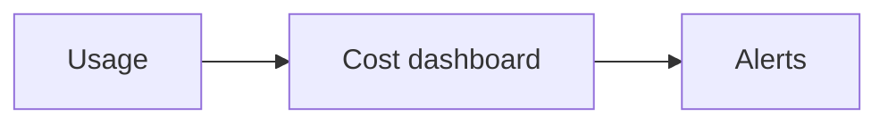

# Cost Management

## Why it matters
Cloud costs grow quickly without visibility and controls.

## Progression checkpoints
| Level | Focus |
| --- | --- |
| Beginner | Use tags and basic budgets. |
| Intermediate | Track cost per service. |
| Senior | Optimize storage and compute usage. |
| Principal | Define cost governance policies. |

## Key concepts
- Tagging and cost allocation.
- Budgets and alerts.
- Reserved instances and savings plans.

## Real-world example: Cost spikes
An untagged data pipeline spikes costs; alerts flag the team to optimize.

## Diagram

## Practical checklist
- Tag all resources with owner and service.
- Set budgets and alert thresholds.
- Review cost reports monthly.
