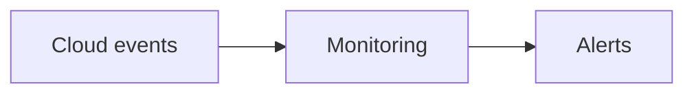

# Cloud Observability

## Why it matters
Cloud-specific signals (service metrics, logs, and events) are critical for
operational awareness.

## Progression checkpoints
| Level | Focus |
| --- | --- |
| Beginner | Use cloud monitoring basics. |
| Intermediate | Centralize logs and metrics. |
| Senior | Correlate cloud events with incidents. |
| Principal | Define observability standards for cloud services. |

## Key concepts
- Cloud metrics and health checks.
- Audit logs and event streams.
- Resource-level dashboards.

## Real-world example: Storage alerts
An object store emits events when error rates increase; alerts notify on-call.

## Diagram

## Practical checklist
- Enable audit logs for critical services.
- Monitor quotas and service limits.
- Centralize cloud events in SIEM.
