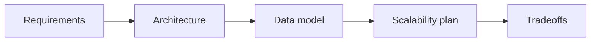

# Case Study Framework

## Why it matters
A repeatable framework ensures consistent, high-quality designs.

## Progression checkpoints
| Level | Focus |
| --- | --- |
| Beginner | Capture requirements and constraints. |
| Intermediate | Define components and data flow. |
| Senior | Address scaling and failure modes. |
| Principal | Lead tradeoff reviews and alignment. |

## Key concepts
- Functional and non-functional requirements.
- Data model and API surface.
- Scaling, reliability, and security constraints.

## Real-world example: New feature kickoff
A team documents requirements, SLA targets, and a phased rollout plan before
coding.

## Diagram

## Practical checklist
- Define SLIs/SLOs early.
- Document assumptions and constraints.
- Review design with stakeholders.
