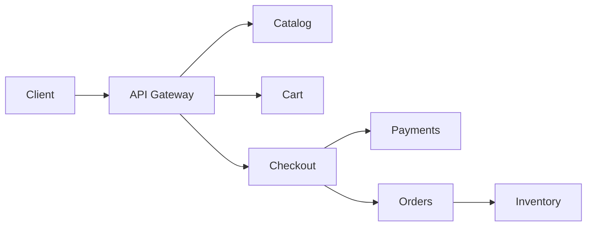

# Ecommerce Platform

## Scenario
Design a platform for product catalog, cart, checkout, and order fulfillment.

## Key concepts
- Catalog search and caching.
- Inventory consistency and reservation.
- Payments and order state transitions.

## Real-world example
A flash sale drives traffic spikes, requiring autoscaling and cache-heavy reads.

## Diagram

## Design checklist
- Use caches for catalog reads.
- Ensure idempotent checkout.
- Plan inventory consistency and backorders.
