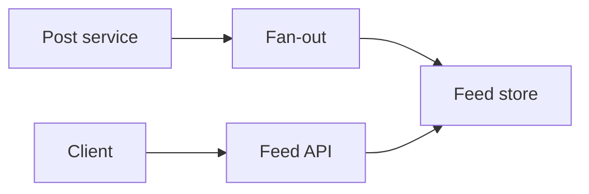

# Social Feed

## Scenario
Design a social feed with posts, likes, follows, and ranking.

## Key concepts
- Fan-out on write vs fan-out on read.
- Feed ranking and caching.
- Consistency and duplication handling.

## Real-world example
Celebrity posts require efficient fan-out to millions of followers.

## Diagram

## Design checklist
- Choose fan-out strategy based on scale.
- Cache hot feeds.
- Handle idempotent writes for retries.
