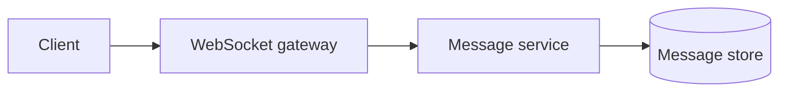

# Chat and Messaging

## Scenario
Design real-time chat with typing indicators, read receipts, and attachments.

## Key concepts
- WebSocket connections and presence.
- Message ordering and delivery semantics.
- Offline storage and sync.

## Real-world example
A global chat app routes users to the nearest region for low latency.

## Diagram

## Design checklist
- Use ordered partitions per conversation.
- Store messages durably before ack.
- Handle reconnects and offline sync.
