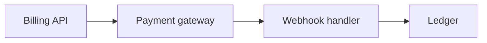

# Payments and Billing

## Scenario
Design a billing system with subscriptions, invoices, and payment retries.

## Key concepts
- Idempotent payment APIs.
- Webhooks and reconciliation.
- Ledger and audit trails.

## Real-world example
Failed payments trigger retries and dunning emails before cancelation.

## Diagram

## Design checklist
- Use idempotency keys for charges.
- Reconcile gateway events with internal ledger.
- Protect PII and PCI data paths.
