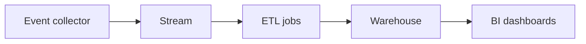

# Analytics Pipeline

## Scenario
Design a pipeline for event ingestion, processing, and reporting.

## Key concepts
- Stream ingestion and buffering.
- ETL/ELT and data quality checks.
- Warehouse modeling and dashboards.

## Real-world example
Product events stream into a warehouse for daily KPI reporting.

## Diagram

## Design checklist
- Handle duplicates and late events.
- Define schema evolution rules.
- Monitor pipeline lag and data quality.
