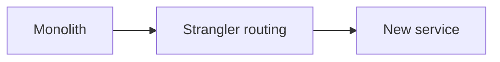

# Migration and Evolution

## Scenario
Evolve a monolith into services while maintaining uptime.

## Key concepts
- Strangler fig pattern.
- Incremental data migration.
- Dual writes and backfills.

## Real-world example
The payments module is extracted first, with dual writes during transition.

## Diagram

## Design checklist
- Define migration phases and rollback plans.
- Keep compatibility during transitions.
- Monitor data divergence carefully.
